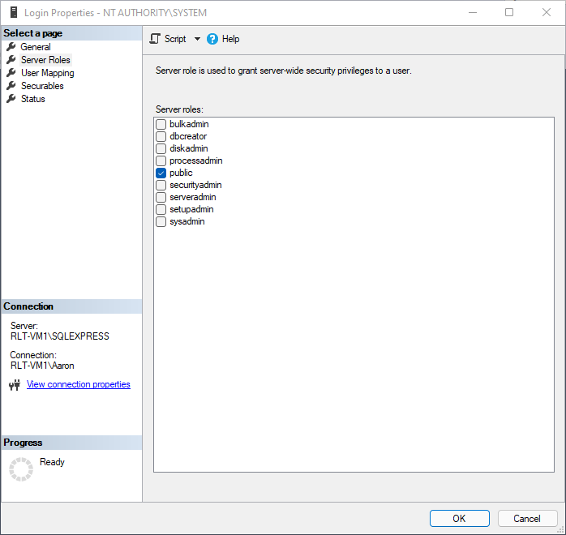

# SQL Databases

## Overview


**Dev Insight:** This script was written to provide SQL backups to clients using [**SQL Express**](https://www.microsoft.com/en-us/sql-server/sql-server-downloads) with a backup solution that doesn't natively support SQL. **It is designed to be used on a schedule in tandem with a file/image-based backup solution.**


This script can be used to automate the creation of SQL database backups.

**Prerequisites:**&#x20;

For this script to run successfully, the user running the script will need to have permission to perform SQL database backups on all databases, including system databases. It is recommended to run the script as `SYSTEM` and set permissions on each database using the process below.



**Granting backup database permissions to `SYSTEM`:**

1. Install & login to [**Microsoft SQL Server Management Studio (SSMS)**](https://docs.microsoft.com/en-us/sql/ssms/sql-server-management-studio-ssms?view=sql-server-ver15) on the SQL Server
2. Navigate to Server\Instance > Security > Logins
3. Right-click `NT AUTHORITY\SYSTEM` and choose **Properties**
4. Under **Server Roles**, make sure `public` is checked
5. Under **User Mapping**, check each database and select the following database role memberships for each:
   1. `public`
   2. `db_backupoperator`

  

After database permissions are set, you can deploy the script via your RMM.

**Notes:**

* Unless changed manually, the default SQL backup location is `C:\Program Files\Microsoft SQL Server\MSSQL.[INSTANCENAME]\MSSQL\Backup`

***

## Script


Backups are not performed on databases named `tempdb.`




## Examples

### Example 1

```powershell
.\BackupSQL.ps1

Checking for necessary PowerShell modules...
Modules installed successfully.

Databases in localhost\SQLEXPRESS:

Name                 Status           Size Owner   
                                                    
----                 ------           ---- -----   
master               Normal        6.00 MB sa      
model                Normal       16.00 MB sa      
msdb                 Normal      149.56 MB sa      

Performing backup of [master]...
Performing backup of [model]...
Performing backup of [msdb]...

Backup jobs complete.
```

This example creates a backup of all SQL databases on every detected instance, excluding temp databases.

### Example 2

```powershell
.\BackupSQL.ps1 -AuditOnly

Checking for necessary PowerShell modules...
Modules installed successfully.

Backup history for localhost\SQLEXPRESS (past month):

DatabaseName BackupSetType BackupStartDate      BackupFinishDate     Compressed
                                                                     BackupSize
------------ ------------- ---------------      ----------------     ----------
master            Database 2/1/2022 12:15:26 PM 2/1/2022 12:15:26 PM    3825664
master            Database 2/1/2022 1:11:16 PM  2/1/2022 1:11:16 PM     3821568
master            Database 2/1/2022 1:51:43 PM  2/1/2022 1:51:43 PM     3821568
master            Database 2/1/2022 2:07:29 PM  2/1/2022 2:07:29 PM     3821568
model             Database 2/1/2022 12:15:26 PM 2/1/2022 12:15:26 PM    2578432
model             Database 2/1/2022 1:11:16 PM  2/1/2022 1:11:16 PM     2574336
model             Database 2/1/2022 1:51:43 PM  2/1/2022 1:51:43 PM     2574336
model             Database 2/1/2022 2:07:29 PM  2/1/2022 2:07:29 PM     2574336
msdb              Database 2/1/2022 12:15:27 PM 2/1/2022 12:15:29 PM  126077952
msdb              Database 2/1/2022 1:11:16 PM  2/1/2022 1:11:19 PM   126073856
msdb              Database 2/1/2022 1:51:43 PM  2/1/2022 1:51:48 PM   126073856
msdb              Database 2/1/2022 2:07:29 PM  2/1/2022 2:07:32 PM   126073856

No new backups were performed.
```

This example displays database backups performed in the last month. It does not perform new backups.

***

## Parameters

### Optional Parameters

`-AuditOnly`

Switch parameter that outputs a history of all database backups for the last month. No additional backups are performed when using this parameter.
